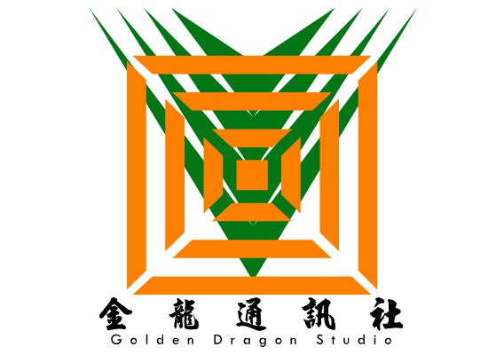

# 基本信息 #

**世界观（时空帧）：** AC/常磐大逃杀（时空帧#104B6）

**名称：** Crimson Swear（赤红誓言）

**中文名称：** 红杀

**组织性质：** 私密型佣兵机构，表面上为买卖各种信息的合法公司。

**组织简介：**

市内著名的有着近百年历史的信息情报界大鳄公司『金龙通信社』的正体。

虽然起家的时候是一个热衷于刺杀，离间，扰乱，并且通过绑架和威胁发展成员的地下机构，但是因为近年需要这些像忍者一样的服务的需求大幅度减少，高层们在现任当家之前就已经有决定想让这个组织正规化，以前做过的任何不合道义的事情，将全部作为黑历史一笔勾销。

当然，所谓的正规化，也不过是从土匪样的道德准则变成了好汉样的道德准则而已。这是因为直到这一届之前组织的高层都是江湖意识入脑深刻的人物。

在组织内，也有传言说想将红杀洗白的理由之一，是因为现在的商场变成了信息的战斗，其从其表面主业相关的内容上，可以挣更多的钱。所以没有必要去让自己的手上沾血了。

的确，从上一届当家开始，红杀组织并没有进行过任何一次的刺杀行动。虽然同样属于台面下的行为，例如信息偷窃，谍报行动或者大人物保镖等倒是一直在做。

目前，红杀的高层决策者是世袭制，现任当家红暮之前的所有当家人皆为男性。而成员的招募是使用口耳相传的方式，发展可能对这种台面下的事情有兴趣的闲散人员，给予他们严格的武学和谍报训练后，根据客户的需求（和给予的钱款），将对应的成员派出执行任务。

虽然现任当家上任后，为了进一步将组织洗白，已经解除了成员需要接受的很多训练内容。取而代之的是，对成员的发展和审核，进行了诸多的限制。

也有传言说，红杀中比较黑暗的一部分，并不是什么能洗白的东西，只不过是消失在了绝大多数的人的视野之外，毕竟需要『让什么人永久闭嘴』或者『让什么人永远消失』这样的需求，什么时候都会有。

作为成员，想在现在的红杀组织中出人头地，只有通过在任务中完成很高的评价这一条路可以走。

虽然以前有类似于比武大会的『只要将对手除掉就能升级』的克林贡式晋升通道，但是新人当家红暮上任后，就将这条路堵死了。理由是发生了流血事件的话，以现在的刑侦技术，没有可能将其保密。

其表面公司，『金龙通讯社』，处于极东之国沿海城市的市中心，管理者为现任当家，用正常的方式招收正常的白领。主要负责的业务是信息的收集和处理。包括但不限于翻译业务，宣传业务以及猎头业务。是市内口碑很高的综合实业公司。金龙通讯社

红杀通过在表里两界的共同成功，聚集了不少的财产。

# 故事中经历： #

被林氏工业的董事长林无月雇佣为『虚拟世界的保镖』。因为开出的价位过于高昂，按照规则，现任当家将自己派了出去，代替已经失败的防护系统守卫虚拟世界——狙击一切来犯之敌。

但是，其所不知道的是，这只是黑幕拖延时间用的计策，让想介入此事的时空特使们将主要目标投在红杀，以及其雇佣者林无月的身上。

而且，黑幕本身并不赞同林无月雇佣人去做这种类型的事情，因为对黑幕来说，这代表要封嘴的人数……又增加了很多。

这某种程度上来讲，对红杀是很讽刺的。

目前，红杀高层有6人的长老会，2人的最高决策，8人的中级干部，以及200余名其他成员。（这个数值没有算上表界的金龙通讯社的员工，也没有算上可能存在的红杀里侧——传言只是传言而已。）

# 其他轶事： #

【红暮】『什么人想出来的天才主意，将自己的队旗翻个面就能拿到表界去了么？！』
【红杀杂兵】『红大小姐……这个旗帜的设计者是你爷爷……』
【红暮】『……』

【红暮】『应该说不将以前的龙虎旗拿来翻面就已经是万幸了……』（捂脸）

[【返回设定页面】](https://amarillonmc.github.io/Settings/)